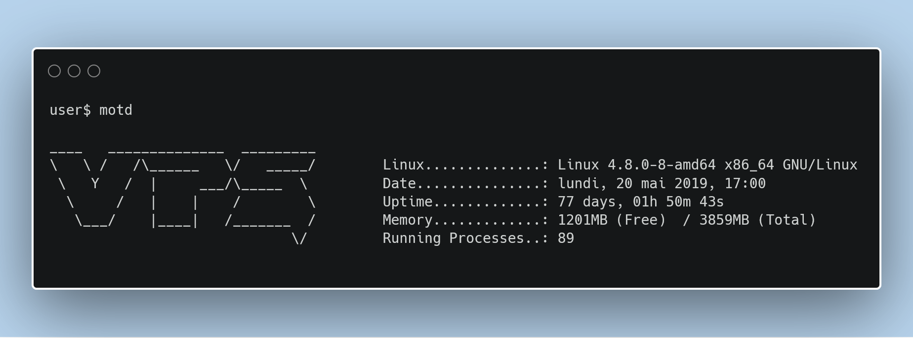
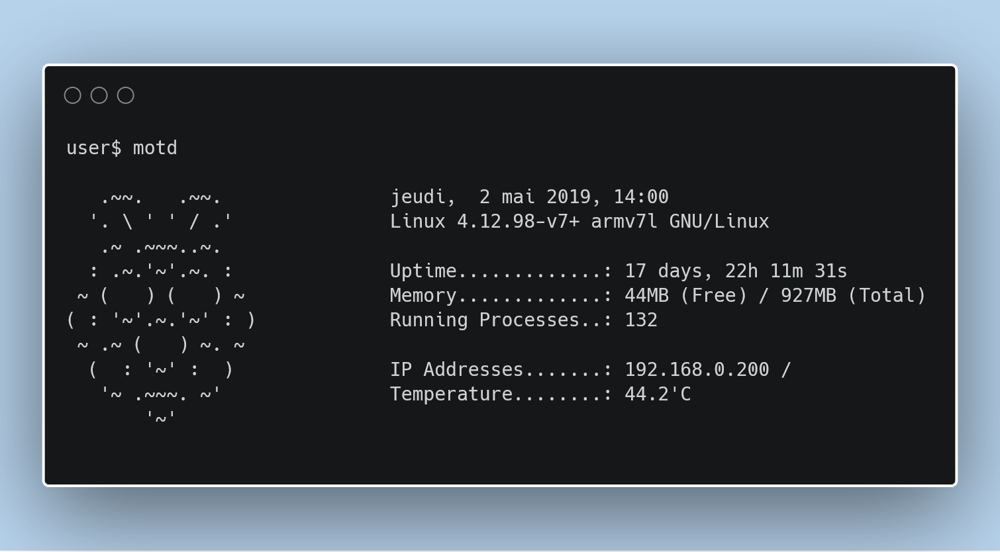

# Update MOTD
Lil Script that update the MOTD (Message Of The Day) with some data : Uptime, Linux Distro, RAM &amp; Running Processes

## How to use it
Clone the repo with :

    git clone https://github.com/YA-MTP/update_motd.git

Edit your crontab to run the script every 10 min (or as you want) : `sudo contab -e`

    */10 * * * * /home/user/scripts/./update_motd.sh >/dev/null 2>&1

The script will update the MOTD, you can see the MOTD at each SSH connection, or create a command alias: `nano ~/.bashrc` *(or ~/.zshrc)* :

    alias motd='cat /etc/motd'

